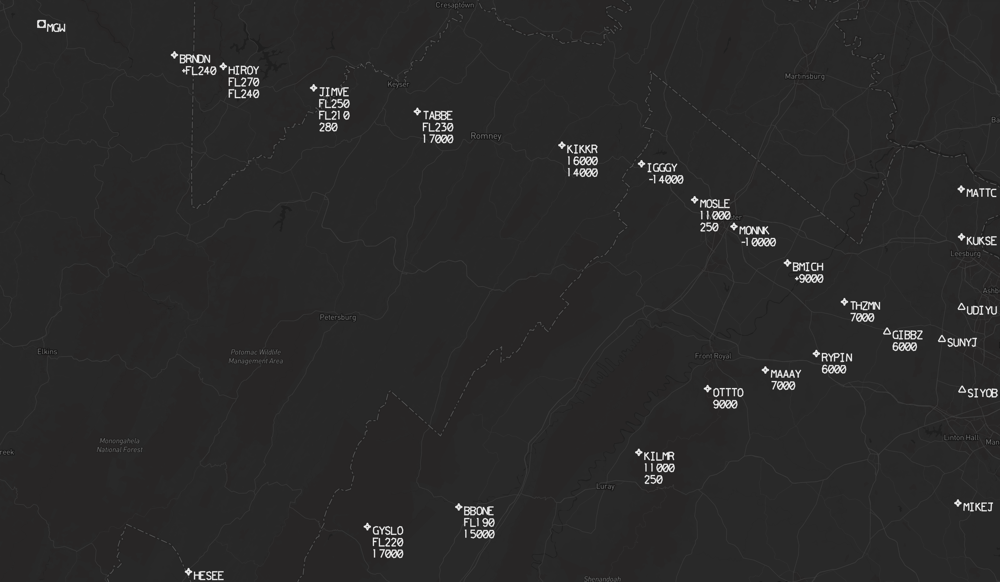
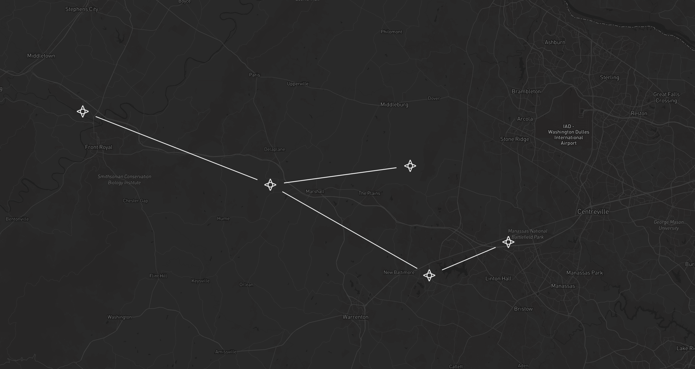
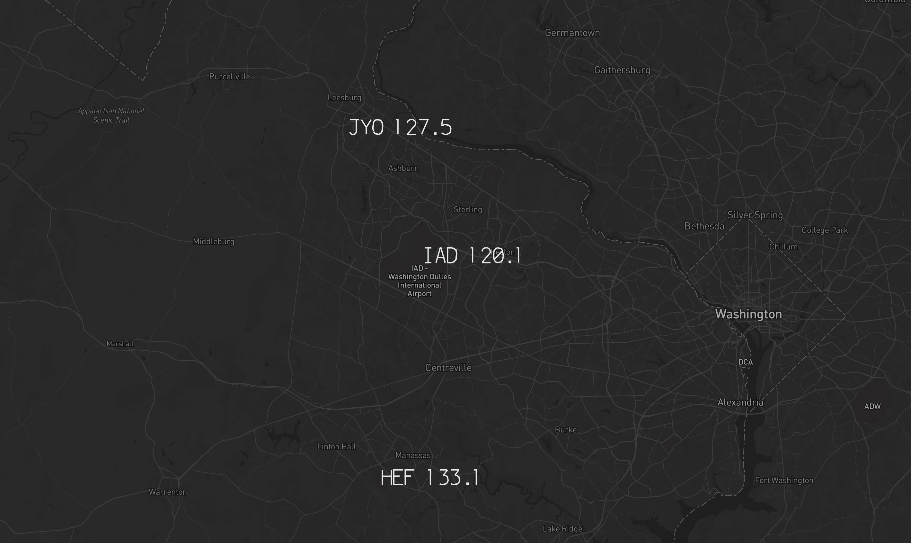

# Examples

The information in the [README](../README.md) is pretty dense. To help explain, here are a few examples showing the settings in the manifest, and the resulting maps:

## SID / STAR

### STAR Symbols and Text

This manifest calls for a map of the `GIBBZ` STAR to KIAD. It has no line draw, but symbols, altitudes, speeds, and names. The text has been moved to the right slightly via the `"x_offset": 1`, and down slightly via the `"y_offset": -1`.

```json
{
  "map_type": "STAR",
  "definition": {
    "airport_id": "KIAD",
    "procedure_id": "GIBBZ#",
    "line_type": "none",
    "draw_symbols": true,
    "draw_altitudes": true,
    "draw_speeds": true,
    "draw_names": true,
    "x_offset": 1,
    "y_offset": -1,
    "draw_enroute_transitions": true,
    "draw_runway_transitions": true,
    "file_name": "003_GIBBZ"
  }
}
```



### SID Symbols and Lines

This manifest calls for a map of the `BUNZZ` SID from KIAD. It has a `"solid"` line draw, and symbols. The lines are automatically truncated around the symbols. While this SID has performance-based data between the airport and the first points (runway heading to 500' AGL, then a turn to direct), the script is not yet able to plot the data.

```json
{
  "map_type": "SID",
  "definition": {
    "airport_id": "KIAD",
    "procedure_id": "BUNZZ#",
    "line_type": "solid",
    "draw_symbols": true,
    "draw_enroute_transitions": true,
    "draw_runway_transitions": true,
    "file_name": "003_BUNZZ"
  }
}
```



## Label

### Label Frequencies

This example calls for a map of three labels, showing its usefulness in creating frequency/handoff maps.

```json
{
  "map_type": "LABEL",
  "definition": {
    "lines": [
      {
        "line": "JYO 127.5",
        "lat": 39.0779722,
        "lon": -77.5575
      },
      {
        "line": "IAD 120.1",
        "lat": 38.9474564,
        "lon": -77.4599286
      },
      {
        "line": "HEF 133.1",
        "lat": 38.7210247,
        "lon": -77.5151047
      }
    ],
    "file_name": "AREA_TOWER_FREQS"
  }
}
```



### Label Supported Characters

This example calls for a map of three labels, showing the supported characters.

```json
{
  "map_type": "LABEL",
  "definition": {
    "lines": [
      {
        "line": "A B C D E F G H I J K L M N O P Q R S T U V W X Y Z",
        "lat": 40,
        "lon": -44
      },
      {
        "line": "0 1 2 3 4 5 6 7 8 9",
        "lat": 39.98,
        "lon": -44
      },
      {
        "line": "+ - .",
        "lat": 39.96,
        "lon": -44
      }
    ],
    "file_name": "LABELS"
  }
}
```


